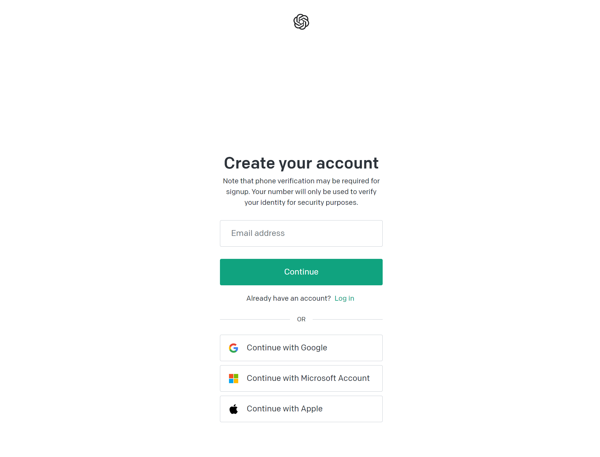
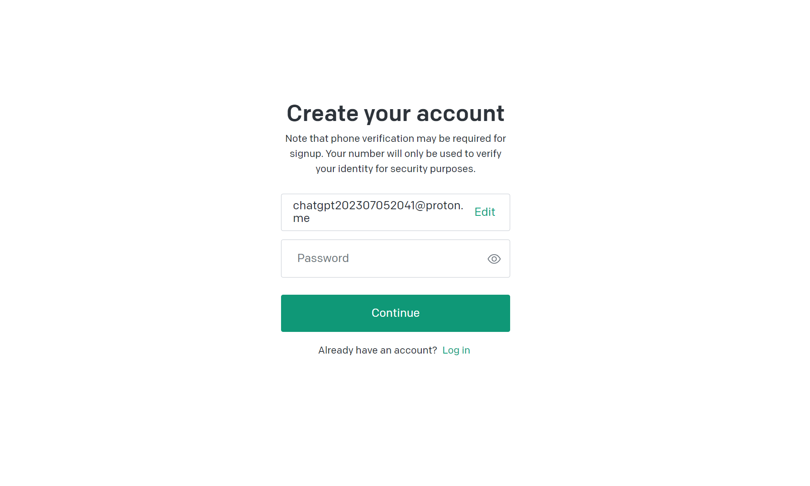
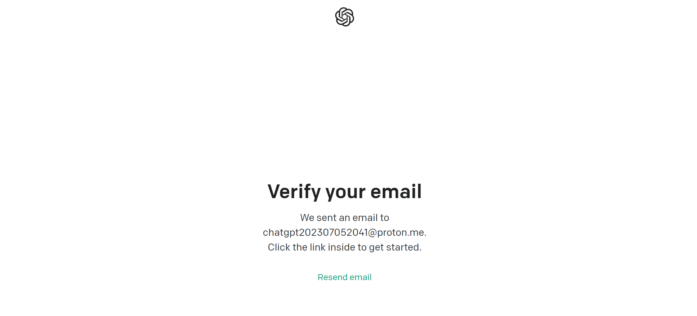
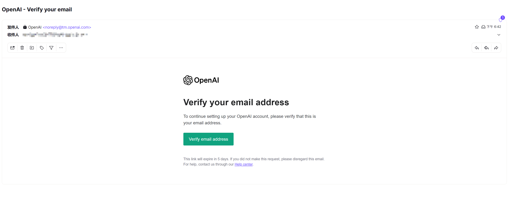
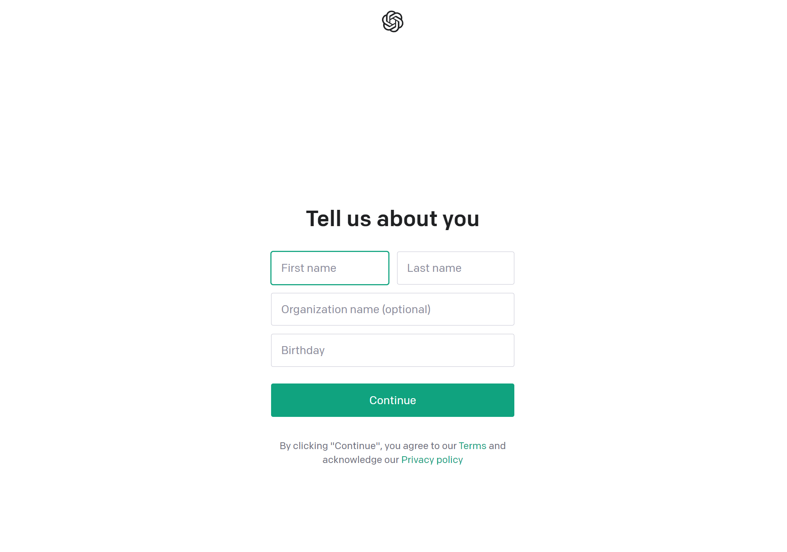
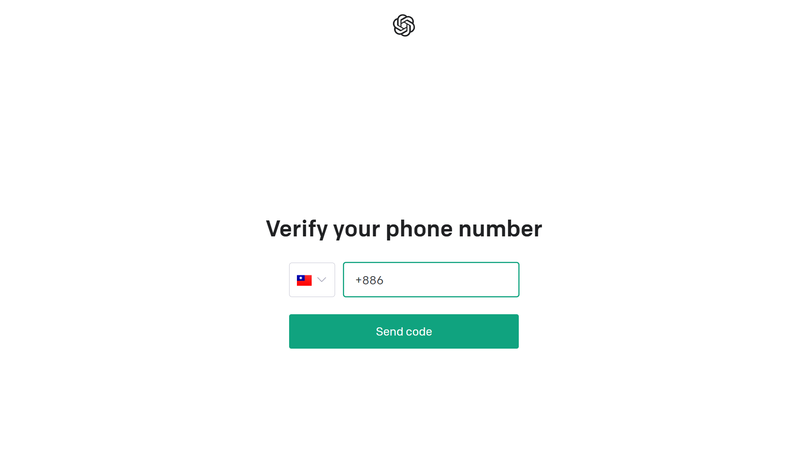
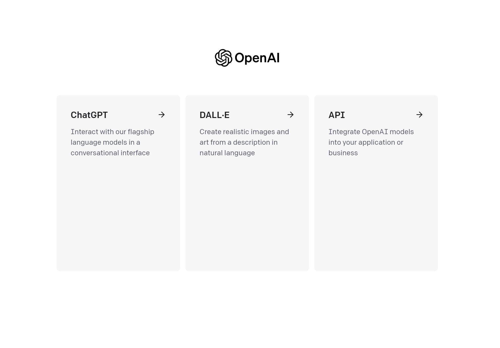
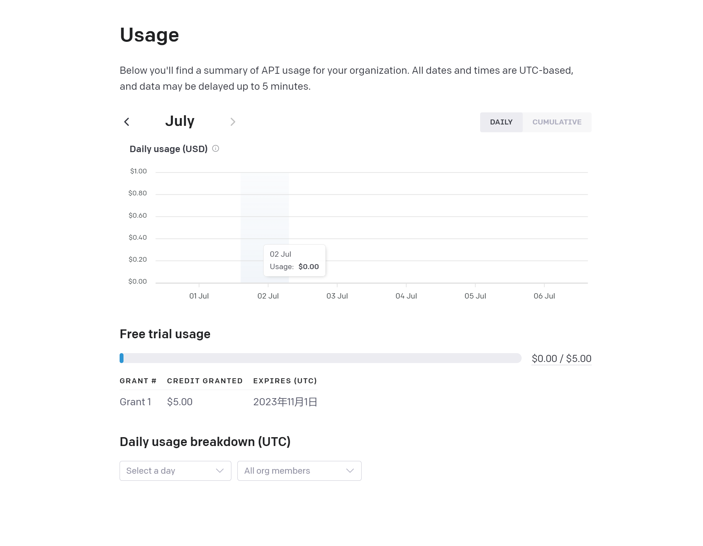
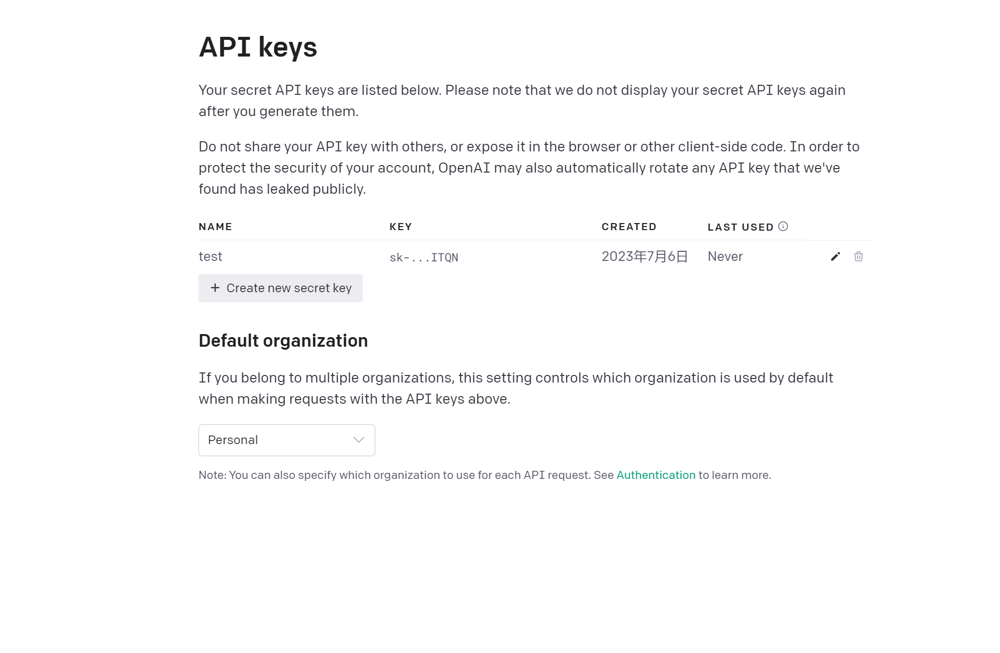

欢迎您阅读本篇文章，本文将为您提供关于如何注册ChatGPT的详细指南。ChatGPT是一个由OpenAI开发的强大的自然语言处理模型，它可以用于各种对话和文本生成任务。

## 准备工作

1、邮箱：需要一个国外邮箱，protonmail，gmail，outlook等等均可。

2、接码平台： 需要一个国外的手机号码，接收ChatGPT发送的验证码，这里为了方便，直接使用sms-active，并向该平台充值卢布。

## 开始

1、首先，您需要访问OpenAI官方网站（https://www.openai.com）以开始注册过程。

2、在OpenAI官方网站上，您将看到一个"Sign up"或"Get started"的按钮。请点击该按钮并按照提示创建一个OpenAI账户。

3、输入您的国外邮箱，点击确认后，进入下一步。

4、设置您的ChatGPT密码。

5、ChatGPT会向您的邮箱发送验证信息。

登录您的邮箱，点击该链接可继续下一步注册。

6、填写个人信息，点击下一步。

7、选择国外某个国家（这里就需要用到前面我们提到的接码平台）。

到 SMS-active 在搜索栏，输入Openai，购买一个你刚刚选择的国家的手机号码，点击购物车即可进行购买（请保证您的账号余额充足）。

8、输入接收到的短信码，即可成功注册。

## 验证

1、访问[登录](https://chat.openai.com/auth/login)，登录刚刚注册成功的ChatGPT账号，体验一下。

点击最左侧的卡片是进入官方网站

2、接着来到 [ChatGPT API](https://chat.openai.com/auth/login) 的页面，检查账号的api调用余额。

免费账号有5刀的API调用额度。可用于代码开发

代码根据生成的密钥，调用ChatGPT的API

## 升级

免费账号，使用的ChatGPT3.5的模型，如果你有需要可以点击web站点的 升级 按钮进行升级到ChatGPT4.0。

升级ChatGPT4.0需要每月支付20刀的费用，而且需要海外的IP和信用卡才能进行注册，对于普通用户来说，门槛较高，后面我会出一个升级的教程。