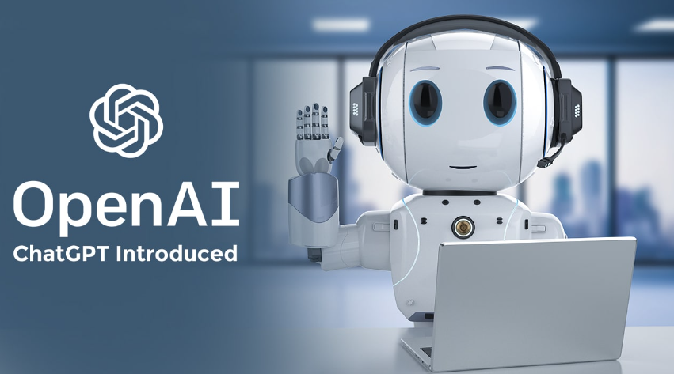

欢迎您阅读本篇文章，本文将为您提供关于如何ChatGPT的背景知识。ChatGPT是一个由OpenAI开发的强大的自然语言处理模型，它可以用于各种对话和文本生成任务。
## ChatGPT是什么?

ChatGPT 是一种基于 GPT（Generative Pre-trained Transformer）模型的聊天机器人。GPT 是由 OpenAI 开发的一种自然语言处理模型，它使用了深度学习技术，特别是变形金刚（Transformer）架构，来生成人类类似的文本。

ChatGPT 是基于 GPT 模型训练而成的一个特定应用，旨在为用户提供对话式交互。它可以理解用户输入的自然语言，并以语义合理且连贯的方式生成回复。ChatGPT 使用了大量的训练数据和预训练模型来学习语言的规律和上下文，使其能够产生有意义的回应。

ChatGPT 被广泛应用于各种领域，包括在线客服、虚拟助手、智能对话系统等。它可以回答用户的问题、提供相关信息、执行简单的任务，甚至进行闲聊。然而，需要注意的是，ChatGPT 只是一个模型，它没有自己的实际经验和理解能力，其回答仅基于之前的训练数据和模式匹配。

OpenAI 不断改进和更新 GPT 模型，以提高 ChatGPT 的性能和效果。这意味着 ChatGPT 的功能和表现可能会随着时间的推移而改变和演进。

## ChatGPT能帮你做什么？

  1、  回答问题：ChatGPT 可以根据用户提出的问题或查询，提供相关信息和答案。

  2、  虚拟助手：它可以作为虚拟助手，帮助用户执行任务，例如设置提醒、查询日历、发送电子邮件等。

  3、 语义理解：ChatGPT 可以理解用户的意图和语义，并针对不同的用户输入作出合理的回应。

  4、闲聊：作为聊天机器人，ChatGPT 可以进行有趣的、有意义的闲聊，回答用户的聊天对话。

  5、代码生成：ChatGPT 可以生成简单的代码，例如根据用户描述生成 HTML、CSS 等。

  6、写作协助：它可以帮助用户写作，提供文章、段落、句子的建议和灵感。

  7、教育和学习：ChatGPT 可以回答学术问题、提供解释和教学材料。

  8、翻译：它可以帮助进行简单的语言翻译任务。

  9、娱乐：ChatGPT 可以进行有趣的问答游戏、谜语等娱乐活动。
