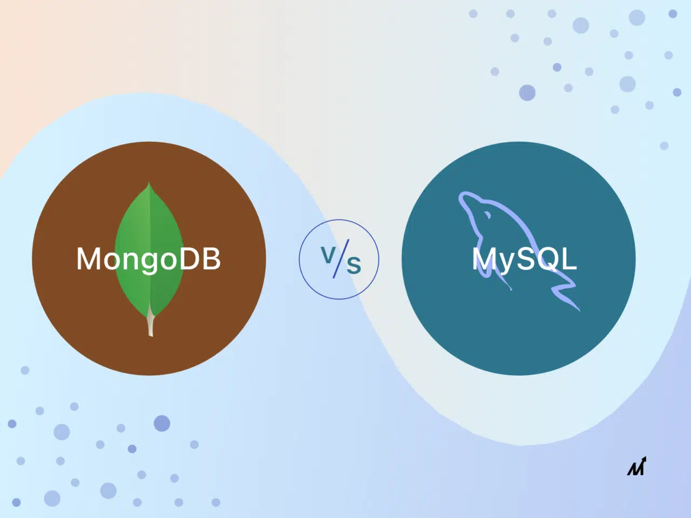

欢迎您阅读本篇文章，本文将为您介绍 mysql 相关的知识。

## 区别

简单说说，关系型数据库和非关系型数据的比较明显的区别。其实故名思意，重点就在关系二字。

关系型数据库，以关系为核心，这种关系体现在数据表的关系和连接上。mysql 作为最经典的关系型数据库之一，通过外键的机制，能够很好的实现不同数据表之间的关联关系，进而实现数据的存储与维护。

在 mysql 中，通过外键定义表之间的关联关系。外键指的是一个表中的字段，这种关联关系有助于保证数据的一致性和完整性，同时也方便了数据的查询和操作。

非关系型数据库，又被成为 NoSQL 数据库，mongodb 正是其中的佼佼者。NoSQL 数据库不依赖于严格的表结构和依赖关系，数据通常以键值对，文档，列祖或图等非结构化或半结构化的形式进行存储。

相比于关系型数据库，数据的类型和格式更加的灵活。数据之间的关联关系，通常由应用程序来管理和维护，而不是由数据库本身去管理。这也意味着在涉及到复杂的关联关系时，在程序的维护，会遇到一些挑战！

但是，正所谓术业有专攻，我们只需要善加利用不同数据库的特点，就可以发展其威力，成熟的程序猿，不应是只选择其中一个，而是我全都要。

## 优势

关系型数据库对比非关系型数据库的优势：

1、严格的数据一致性和完整性： 关系型数据库通过严格的数据模型、约束和事务支持，确保数据的一致性和完整性。这对于许多应用场景，特别是需要强调数据准确性和可靠性的企业应用非常重要。

2、复杂查询和数据分析： 关系型数据库通常支持SQL语言，可以进行复杂的查询和数据分析操作，包括联合查询、聚合函数、子查询等。这使得关系型数据库在需要进行复杂数据分析和报表生成的场景下更具优势。

3、事务支持： 关系型数据库提供强大的事务支持，能够确保一组数据库操作要么全部成功执行，要么全部失败回滚。这对于需要保证数据一致性和完整性的应用非常重要，比如金融系统或电子商务平台。

4、成熟的技术和生态系统： 关系型数据库是传统的数据库模型，拥有成熟的技术和生态系统。有大量的文档、教程和社区支持可供参考，以及各种第三方工具和库可供使用。

5、灵活的数据模型： 尽管关系型数据库的数据模型相对固定，但通过使用复杂的关联关系和规范化设计，可以支持灵活的数据模型，并且可以进行复杂的数据查询和操作。

## 总结

总的来说，关系型数据库在保证数据一致性、支持复杂查询和分析、提供事务支持等方面有着明显的优势，尤其是在需要强调数据准确性和可靠性的企业应用场景下。

然而，随着非关系型数据库的发展，对于需要处理大规模非结构化或半结构化数据、需要更高的可扩展性和灵活性的应用，NoSQL数据库可能更适合。因此，在选择数据库时，需要根据具体的应用需求和场景来进行评估和选择。