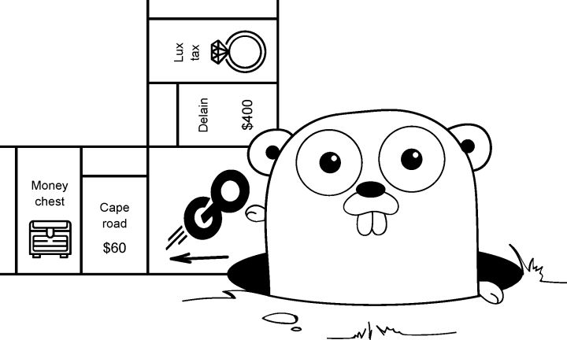

欢迎您阅读本篇文章，本文将为您 Go 语言。Go 是一种编程语言，也称为 Golang。

## 关于 Go

Go 由 Google 开发并于 2009 年首次发布。它是一种静态类型、编译型、并发性强的语言，具有内置的垃圾回收机制和丰富的标准库。Go 语言被设计用于简化并发编程，并具有高效的编译速度和良好的性能。它支持面向对象、函数式编程和并发编程模式，被广泛应用于构建网络服务、分布式系统、云平台和大规模软件项目。

Go 语言相对于其他语言的优势包括：

并发编程支持： Go 语言内置了轻量级的并发模型，通过 goroutines 和 channels 可以方便地实现并发编程，处理并发任务更加高效。

内置工具： Go 语言提供了丰富的标准库，包括网络、IO、加密、测试等功能，使得开发者可以快速构建各种类型的应用程序，减少了对第三方库的依赖。

静态类型检查： Go 是一种静态类型语言，具有强类型检查和编译时类型检查的特性，可以在编译阶段发现并修复许多错误，提高了代码的可靠性和稳定性。

简洁的语法： Go 语言设计简洁，语法清晰易懂，使得代码编写和维护更加高效和简单。

快速编译： Go 语言的编译速度非常快，可以快速生成可执行文件，加快了开发迭代和部署的速度。

跨平台支持： Go 语言支持跨平台编译，可以在多种操作系统上运行，包括 Windows、Linux、macOS 等。

内置并发模型： Go 语言通过 goroutines 和 channels 提供了内置的并发模型，使得编写并发代码更加简单和直观，避免了传统并发编程中常见的锁和线程同步问题。

自带工具链： Go 语言自带了丰富的工具链，包括代码格式化工具、性能分析工具、测试工具等，使得开发者可以更加方便地进行代码管理和调试。

总体来说，Go 语言的优势在于其并发模型、简洁的语法、快速编译、跨平台支持和丰富的标准库，使得它成为构建高性能、可靠性和可维护性的软件的理想选择。
